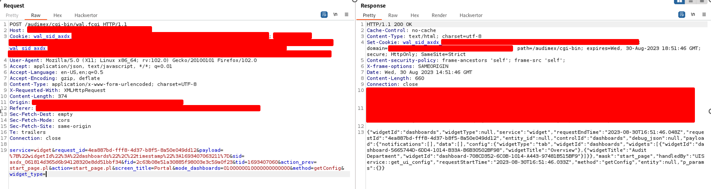
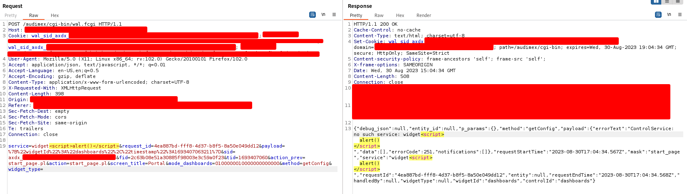
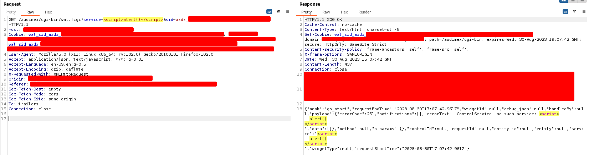
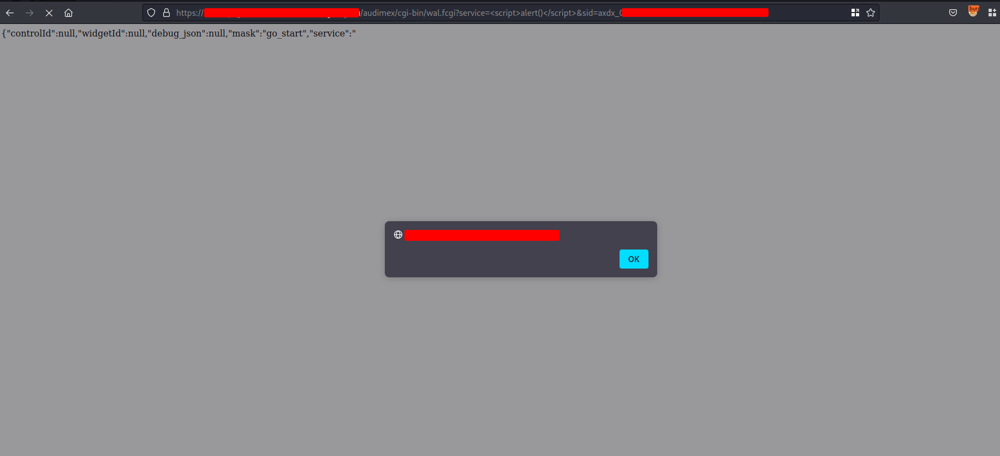

# Report

## Overview
During a penetration testing activity for an Accenture client, our team discovered a Reflected Cross-Site Scripting (XSS) vulnerability in AudimexEE 15.1.2.

## Description
Cross-Site Scripting (XSS) attacks are a type of injection in which malicious script are loaded into trusted website in the form of a browser side script. The malicious script could gain access to sensitive information, like session tokens, or run arbitrary code which can be used to carry out further attacks.

Reflected XSS are a kind of attack where the injected script is reflected off the web server, such as in error messages, search results, or any other response.

The target resource has multiple injection points in which user input is not correctly sanitized, this allows malicious payloads to be executed on the victim's browser.

List of the vulnerable parameters: 

- service;
- method;
- widget_type;
- request_id;
- payload.

## Risk
- Severity: Medium
- CVSS v3.1 Score: 4.1
- CVSS v3.1 Vector: AV:A/AC:L/PR:L/UI:R/S:U/C:L/I:L/A:N

## Affected URLs
- https://\[HOST\]/audimex/cgi-bin/wal.fcgi

## Reproducing Steps
After authenticating on the AudimexEE portal with an 'any' profile and navigating in the main page using a proxy tool such as BurpSuite, it is possible to intercept and analyze the HTTP POST request which loads widget information (Figure 1).


Figure 1: POST request sent during homepage navigation.

A JavaScript payload can be inserted into the POST parameters listed above, which values are reflected twice in the response HTML page. For simplicity’s sake, it will be shown only a PoC for service parameter, but same steps apply for the others.
As visible in Figure 2, the following injected code has been included into the HTML response page: 

```
<script>alert()</script>
```


Figure 2: JavaScript payload injected in the POST request and correctly reflected in the response.

It is also possible to inject the payload by sending the same request using GET method (Figure 3).


Figure 3: JavaScript payload injected in the GET request and correctly reflected in the response.

After the injection, the payload is correctly executed twice in the web browser, as visible in Figure 4.


Figure 4: JavaScript payload executed within the web browser.

### Mitigations

To prevent cross-site scripting vulnerability it is possible to adopt one or more combination described below:
- Filter input: all the user input and parameters should be validated server-side in order to check and filter any unexpected symbols;
- User Input should be HTML-ENCODED: all html symbols should be replaced with the corresponding HTML entities, such as &lt and &gt.

For further information visit the following links:
- https://owasp.org/www-community/attacks/xss/
